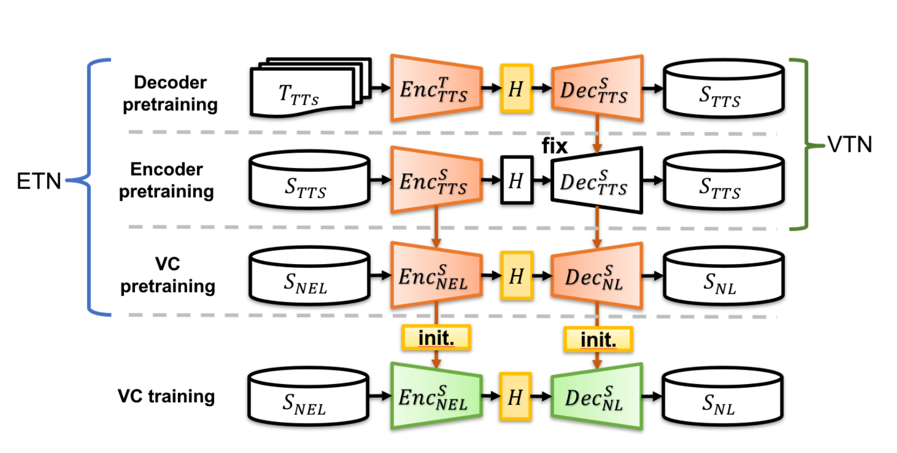
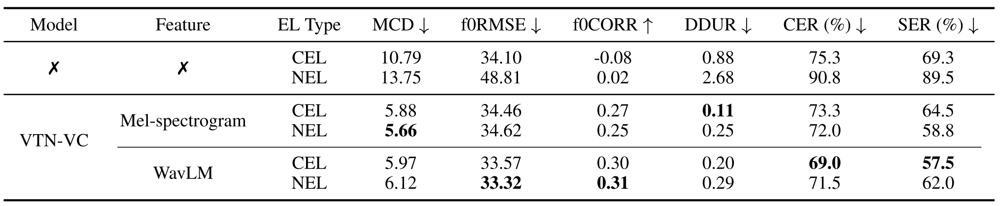
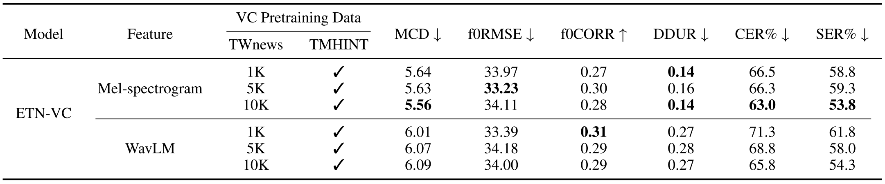
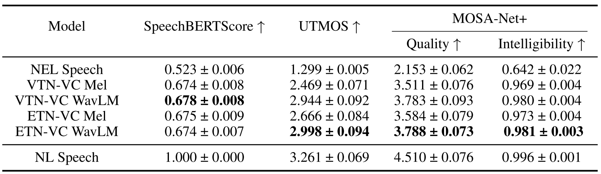
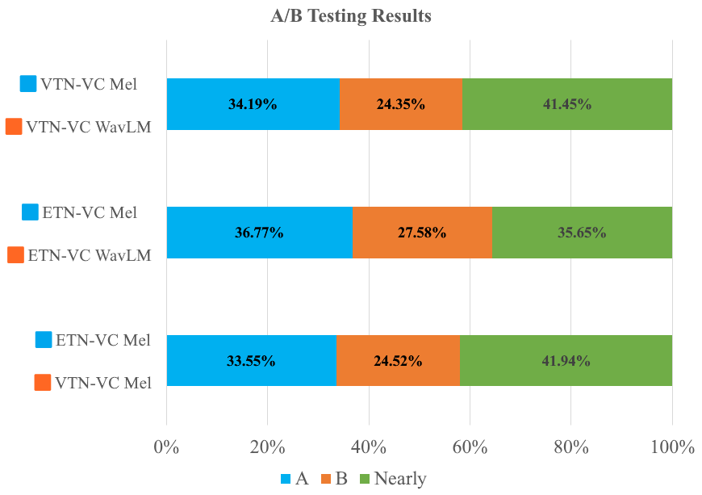
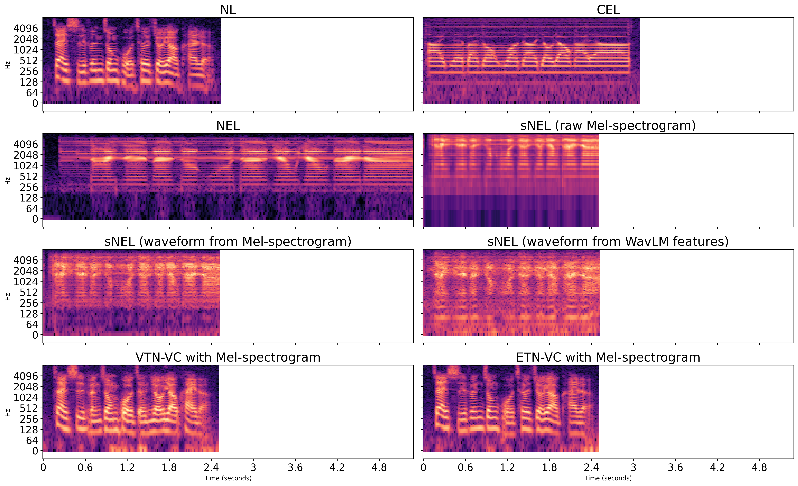

# A Preclinical Study of Electrolaryngeal Voice Conversion for a Novel Nasal Electrolarynx: Feature Choice and Data Augmentation

## Abstract
Electrolaryngeal (EL) speech often exhibits reduced intelligibility and naturalness due to imperfect excitation and fixed pitch. In this preclinical study, we present the first systematic investigation of electrolaryngeal voice conversion (ELVC) for speech produced by a newly invented nasal electrolarynx (NEL), extending prior work that mainly targets cervical EL (CEL) speech. We examine feature choice under NEL’s distinctive acoustics by comparing Mel-spectrograms and the 6th-layer WavLM representation as inputs to a seq2seq ELVC system. To address NEL data scarcity, we propose an LLE-VC--based augmentation strategy to synthesize paired sNEL--sNL speech for VC pretraining. Experiments reveal device-dependent trends: the chosen WavLM representation benefits CEL-oriented conversion and augmentation, whereas Mel-spectrogram inputs better preserve NEL-specific spectral characteristics and yield better intelligibility-related metrics and listener preferences for NEL-to-NL conversion.

<!-- ## Model Architecture -->
## Architecture and Experimental Settings

* Fig. 1. Overview of CEL and NEL speech production. The left panel shows speaking with a traditional cervical EL (CEL) device, the right panel shows speaking with a new nasal EL (NEL) device, and the middle two panels show the differences between speaking using the two assistive devices.

1. VTN-VC:
Two pretraining stages with a large-scale NL corpus; VC training stage with the EL dataset.

2. ETN-VC:
Two pretraining stages with a large-scale NL corpus; VC pretraining stage with the sEL and EL corpora; VC training stage was further fine-tuned on the EL dataset.

<!-- ## Experimental Setting -->

### EL dataset
1. CEL-NL: 320 utterances of parallel corpus
2. NEL-NL: 320 utterances of parallel corpus

- All utterances were recorded by the same speaker.

### sEL dataset

- TWnews: 10,000 generated utterances as augmented parallel corpus
<!-- - GPTgen: 10,000 generated utterances as augmented parallel corpus -->

The sNL/sEL data were generated based on the above EL dataset.

## Evaluation Metrics

### Objective Metrics

**Spectral distortion related**
* MCD: Mel-cepstral distortion ↓

**Intelligibility related**
* CER: character error rate measured by Whisper ASR ↓
* SER: syllable error rate measured by an ASR system ↓

CER and SER are computed based on edit distance:

`Error Rate = (S + D + I) / N × 100%`

where `S`, `D`, and `I` denote the numbers of substitutions, deletions, and insertions, respectively, and `N` is the number of reference units. For CER, the reference units are characters; for SER, the reference units are syllables. Since insertion errors are included in the numerator, the error rate can exceed 100% when the number of insertions is large.

**F0 / Pitch related**
* F0 RMSE: root mean square error of F0 ↓
* F0 CORR: correlation coefficient of F0 contours ↑

**Duration related**
* DDUR: average absolute duration difference between the converted and target utterances ↓

**Speech quality related**
* UTMOS ↑
* MOSA-Net+ ↑

**Semantic consistency related**
* SpeechBERTScore ↑

### Subjective Metrics

**Human listening test**
* A/B intelligibility test: listeners select the more intelligible sample or “no preference.”

## Experimental Results

| System | CER (%) ↓ | SER (%) ↓ |
|---|---:|---:|
| Unprocessed NEL speech | 90.8 | 89.5 |
| SeedVC | 71.8 | 84.8 |
| MKL-VC | 85.0 | 99.5 |
| Vevo | 84.0 | 101.5 |

Among the zero-shot VC baselines, SeedVC achieved the lowest CER and SER. However, all zero-shot VC systems still showed high error rates, suggesting that generic zero-shot VC models remain insufficient for NEL speech conversion.

* Table. I. Performance comparison of VTN-VC models on CEL-to-NL and NEL-to-NL tasks using Mel-spectrograms and WavLM features, with metrics of unprocessed raw CEL/NEL speech included for reference. ↑ indicates higher is better, while ↓ indicates lower is better.

* Table. II. ETN-VC trained on the TMHINT training set with 1k/5k/10k TWNews utterances.

* Table. III. SpeechBERTScore, UTMOS, and MOSA-Net+ scores for NEL, NL, and converted speech (mean ± 95\% confidence interval).

* Fig. 2. A/B test results for different model configurations on intelligibility. The bars represent the percentage of subjects' voting for each system (system A, system B, and no preference).

## Audio Sample

**sample 1 (CEL using WavLM features and NEL using Mel-spectrograms, respectively.)**

|   Model   |transcription: 他捐了很多衣物給災區 (Ta juan le hen duo yiwu gei zaiqu)|
|:---------:|:-------------------------------------------------------------------:|
| CEL speech | <audio src="audio/EL01v4/EL01v4_281.mp3" controls preload="none"></audio> |
| NEL speech | <audio src="audio/NEL01v2/NEL01v2_281.mp3" controls preload="none"></audio> |
| VTN-VC CEL | <audio src="audio/EL01v4/VTN-WavLM-EL_281.mp3" controls preload="none"></audio> |
| VTN-VC NEL | <audio src="audio/NEL01v2/VTN-Mel-NEL_281.mp3" controls preload="none"></audio> |
| ETN-VC CEL | <audio src="audio/EL01v4/ETN-WavLM-EL_281.mp3" controls preload="none"></audio> |
| ETN-VC NEL | <audio src="audio/NEL01v2/ETN-Mel-NEL_281.mp3" controls preload="none"></audio> |
| NL speech | <audio src="audio/NL01v4/NL01v4_281.mp3" controls preload="none"></audio> |

**sample 2 (CEL using WavLM features and NEL using Mel-spectrograms, respectively.)**

|   Model   |transcription: 電視報導那裡發生地震 (dian shi bao dao na li fa sheng di zhen)|
|:---------:|:-------------------------------------------------------------------:|
| CEL speech | <audio src="audio/EL01v4/EL01v4_282.mp3" controls preload="none"></audio> |
| NEL speech | <audio src="audio/NEL01v2/NEL01v2_282.mp3" controls preload="none"></audio> |
| VTN-VC CEL | <audio src="audio/EL01v4/VTN-WavLM-EL_282.mp3" controls preload="none"></audio> |
| VTN-VC NEL | <audio src="audio/NEL01v2/VTN-Mel-NEL_282.mp3" controls preload="none"></audio> |
| ETN-VC CEL | <audio src="audio/EL01v4/ETN-WavLM-EL_282.mp3" controls preload="none"></audio> |
| ETN-VC NEL | <audio src="audio/NEL01v2/ETN-Mel-NEL_282.mp3" controls preload="none"></audio> |
| NL speech | <audio src="audio/NL01v4/NL01v4_282.mp3" controls preload="none"></audio> |

**sample 3 (CEL using WavLM features and NEL using Mel-spectrograms, respectively.)**

|   Model   |transcription: 我把不用的傢俱送人了 (Wo ba bu yong de jia ju song ren le)|
|:---------:|:-------------------------------------------------------------------:|
| CEL speech | <audio src="audio/EL01v4/EL01v4_284.mp3" controls preload="none"></audio> |
| NEL speech | <audio src="audio/NEL01v2/NEL01v2_284.mp3" controls preload="none"></audio> |
| VTN-VC CEL | <audio src="audio/EL01v4/VTN-WavLM-EL_284.mp3" controls preload="none"></audio> |
| VTN-VC NEL | <audio src="audio/NEL01v2/VTN-Mel-NEL_284.mp3" controls preload="none"></audio> |
| ETN-VC CEL | <audio src="audio/EL01v4/ETN-WavLM-EL_284.mp3" controls preload="none"></audio> |
| ETN-VC NEL | <audio src="audio/NEL01v2/ETN-Mel-NEL_284.mp3" controls preload="none"></audio> |
| NL speech | <audio src="audio/NL01v4/NL01v4_284.mp3" controls preload="none"></audio> |

**sample 4 (CEL using WavLM features and NEL using Mel-spectrograms, respectively.)**

|   Model   |transcription: 昨天他向我借了三百塊 (Zuo tian ta xiang wo jie le san bai kuai)|
|:---------:|:-------------------------------------------------------------------:|
| CEL speech | <audio src="audio/EL01v4/EL01v4_294.mp3" controls preload="none"></audio> |
| NEL speech | <audio src="audio/NEL01v2/NEL01v2_294.mp3" controls preload="none"></audio> |
| VTN-VC CEL | <audio src="audio/EL01v4/VTN-WavLM-EL_294.mp3" controls preload="none"></audio> |
| VTN-VC NEL | <audio src="audio/NEL01v2/VTN-Mel-NEL_294.mp3" controls preload="none"></audio> |
| ETN-VC CEL | <audio src="audio/EL01v4/ETN-WavLM-EL_294.mp3" controls preload="none"></audio> |
| ETN-VC NEL | <audio src="audio/NEL01v2/ETN-Mel-NEL_294.mp3" controls preload="none"></audio> |
| NL speech | <audio src="audio/NL01v4/NL01v4_294.mp3" controls preload="none"></audio> |

## Spectrogram

* Fig. 3. Mel-spectrograms of NL, CEL, and NEL speech, sNEL speech synthesized using Mel-spectrogram and WavLM features, and converted speech of VTN-VC and ETN-VC (both with Mel-spectrogram). NEL speech is typically longer, whereas synthesized and converted speech follow NL durations due to seq2seq alignment.
